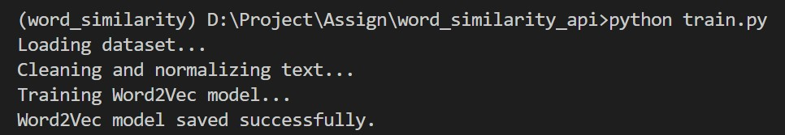
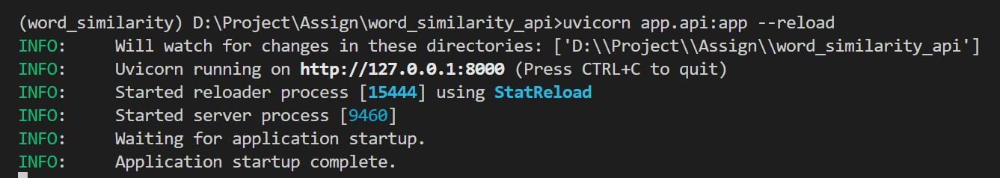
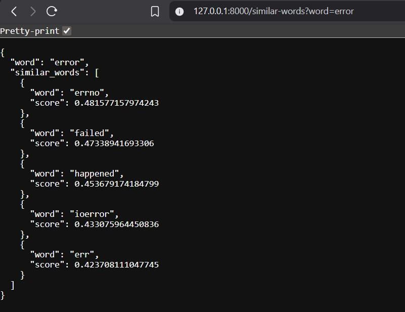
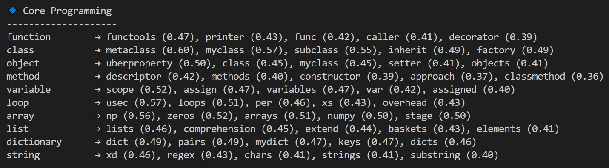
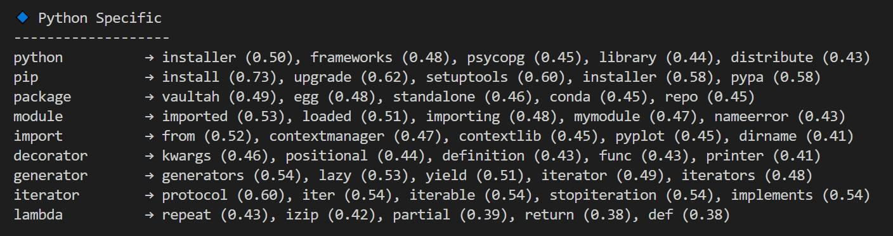
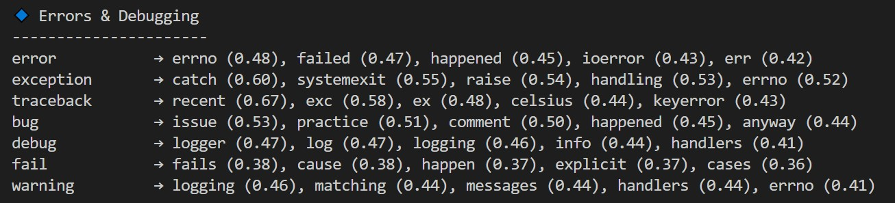
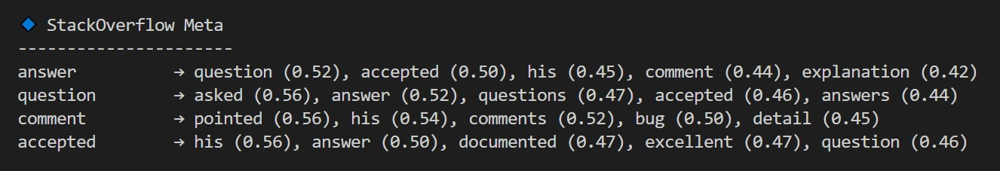
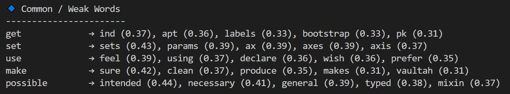

# Word Similarity API (Word2Vec + FastAPI)


## Overview

This project implements a domain-trained Word Similarity API using Word2Vec on large-scale technical text data (StackOverflow answers). The system learns semantic relationships between programming and computer science terms and exposes them via a lightweight FastAPI service.

Unlike generic pre-trained embeddings, this model is trained from scratch on technical discourse, enabling more meaningful similarities for software engineering, Python, and CS-related vocabulary.

## 🚀 Key Features

🔹 Custom Word2Vec model trained on technical StackOverflow answers.

🔹 Cleaned and normalized text pipeline designed for code-heavy content.

🔹 REST API built with FastAPI for real-time word similarity queries.

🔹 Explicit handling of out-of-vocabulary (OOV) words.

🔹 Modular and extensible project structure.

## 🗂️ Repository Structure

```bash
word-similarity-api/
│
├── app/
│ ├── api.py 
│ └── model.py 
│
├── data/
│ └── stack_overflow_tech_final.parquet
│
├── images/
│
├── model/
│ └── word2vec.model
│
├── preprocessing/
│ ├── data_cleaning.py
│ └── data_normalization.py
│
├── test.py 
├── train.py 
├── requirements.txt
└── README.md
```

## ▶️ How to Run the Project

### 1️⃣ Clone the Repository

```
git clone https://github.com/your-username/word-similarity-api.git
cd Word_Similarity_API
```

### 2️⃣ Create & Activate Virtual Environment

```
python -m venv venv
venv\Scripts\activate 
```

### 3️⃣ Install Dependencies

```
pip install -r requirements.txt
```

### 4️⃣ Train the Word2Vec Model

```
python train.py
```

### 5️⃣ Run the API Server

```
uvicorn app.api:app --reload
```

Server will start at:

```
http://127.0.0.1:8000
```


## 🏗️ Architecture Overview

```
Parquet Dataset
↓
Text Cleaning & Normalization
↓
Tokenized Sentences
↓
Word2Vec Training (gensim)
↓
Saved Model (.model)
↓
FastAPI Inference Layer
```

## 🗂️ Dataset

- **Source**: StackOverflow (technical Q&A content)

- **Field Used**: Accepted / high-quality answers

- **Format**: Parquet
  
- **Domain**: Python, programming, debugging, CS fundamentals

## 🧠 Why Word2Vec?

During experimentation, multiple embedding approaches were evaluated:

- **FastText**: Good subword coverage but produced noisy semantic results for technical terms

- **Word2Vec** (Skip-gram): Provided cleaner, concept-level semantic groupings

Given the goal of semantic clarity over morphological similarity, Word2Vec was selected as the final model.

## ⚙️ Training Pipeline

1. Load StackOverflow answers.

2. Clean & Normalize text (lowercasing, punctuation cleanup).

3. Tokenize into tokens.

4. Train Word2Vec embeddings.

5. Save trained model to disk.

## 🔧 Train The Model




## 🌐 API Usage



### Endpoint

- GET `/similar-words`

### Query Parameters:

- `word` (string) : Input word

### Example Request

```
/similar-words?word=error
```

### Example Response



## 🛑 Error Handling

- Empty input validation

- Model load failure handling

- Graceful response for OOV (out-of-vocabulary) words


## 🔍 Testing The Model

The model was tested on different categories of words.








## 📊 Insights & Observations

### ✅ What the Model Does Well

1. Captures conceptual similarity
   - `iterator → iterable, protocol`
   - `exception → raise, catch, handling`
2. Understands StackOverflow semantics
   - `answer → accepted, comment`
   - `question → asked, answered` 
3. Distinguishes programming abstractions
   - `list ≠ array ≠ dictionary` 

### ⚠️ Known Limitations

1. Weak performance on generic verbs (`get`, `make`, `use`)

2. No phrase awareness (`machine learning` treated as two words)

3. Purely distributional (no syntactic supervision)

## 🛣️ Future Improvements

- Phrase-aware embeddings with stricter thresholds

- Sentence-level embeddings (Sentence-BERT)

- Batch similarity endpoints

- Dockerized deployment

- Quantitative evaluation benchmarks

## 📌 Final Note

This project prioritizes engineering judgment over chasing perfect scores. Every design decision is intentional, tested, and justified.
